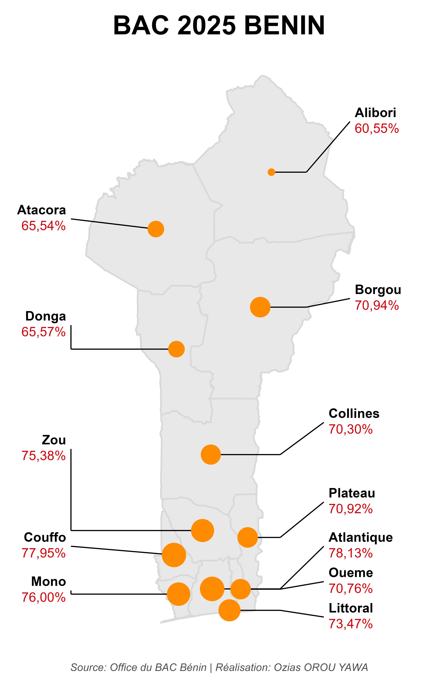

# Ozias OROU YAWA
**Géographe-Écologue | Expert SIG & Analyse de données spatiales**

[À Propos](#about) | [Parcours Académique](#education) | [Expériences](#experience) | [Projets & Recherche](#projects) | [Contact](#contact)

---

## 🌿 À Propos
[cite_start]Je suis passionné par l'étude des écosystèmes forestiers tropicaux. [cite_start]J'applique l'analyse de données spatiales et statistiques pour comprendre l'impact des changements globaux sur la biodiversité. [cite_start]Basé à Parakou, j'interviens comme consultant en SIG pour des études d'impact environnemental (EIE)[cite: 1, 44].

---

## 🎓 Parcours Académique
* [cite_start]**Master 1 en Aménagement et Gestion des Ressources Naturelles** — Université de Parakou (2025-2026)[cite: 5, 6].
* [cite_start]**Formation en Agronomisation** — CePeSA, Université de Parakou (2024–2025)[cite: 8, 9].
* [cite_start]**Licence Professionnelle en Géographie Physique** (Géomatique et Biodiversité) — Université de Parakou (2019–2022)[cite: 11, 12].

---

## 💼 Expériences Professionnelles

### Assistant Consultant SIG (EIE) | Municipalité de Kalalé
[cite_start]*Août 2025* [cite: 45]
* [cite_start]Cartographie de l'état initial pour le projet de dragage de Yolla[cite: 48].
* [cite_start]Analyse des impacts sur les ressources en eau et l'érosion[cite: 50].

### Assistant Cartographe | NASSARA Consulting
[cite_start]*Mai 2025* [cite: 53]
* [cite_start]Élaboration de cartes thématiques pour les couloirs de transhumance[cite: 56].
* [cite_start]Intégration de données GPS et suivi de terrain[cite: 57].

---

## 📊 Projets & Recherche
### Cartographie : Résultats BAC Bénin 2025
Visualisation automatisée des taux de réussite par département à l'aide de R et `ggplot2`.

### Recherche Scientifique
* [cite_start]**Oecophylla longinoda :** Étude de la plasticité comportementale des fourmis tisserandes face au climat[cite: 17, 19].
* [cite_start]**Modèles de Distribution d'Espèces (SDM) :** Introduction aux SDM pour la conservation[cite: 24].

---

## ✉️ Contact
* [cite_start]**LinkedIn :** [ozias-orou-yawa](https://www.linkedin.com/in/ozias-orou-yawa)[cite: 1].
* [cite_start]**ORCID :** [0000-0003-2924-2460](https://orcid.org/0000-0003-2924-2460)[cite: 1].
* [cite_start]**Email :** [oziasorouyawa00@gmail.com](mailto:oziasorouyawa00@gmail.com)[cite: 1].

[Télécharger mon CV (PDF)](CV_Ozias_Janvier 2026.docx)
